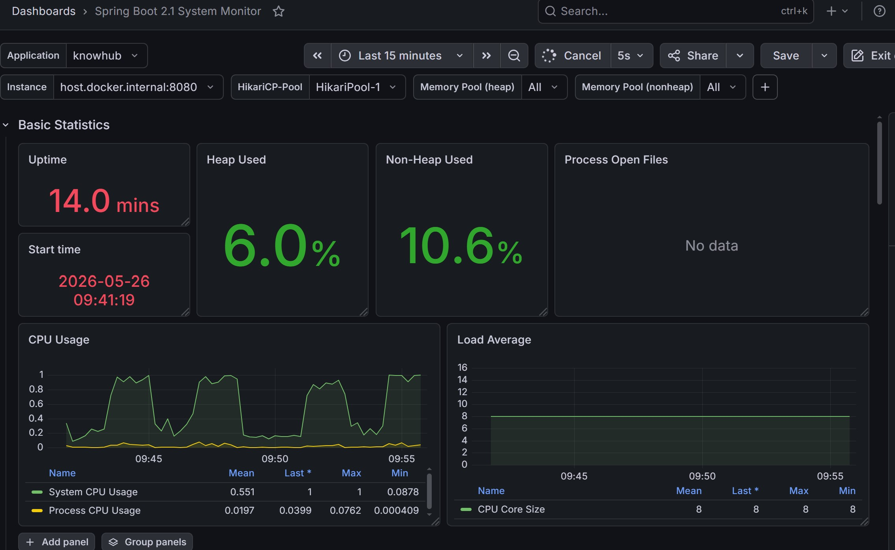
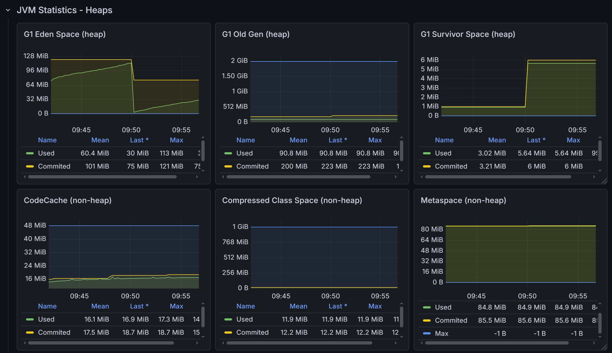
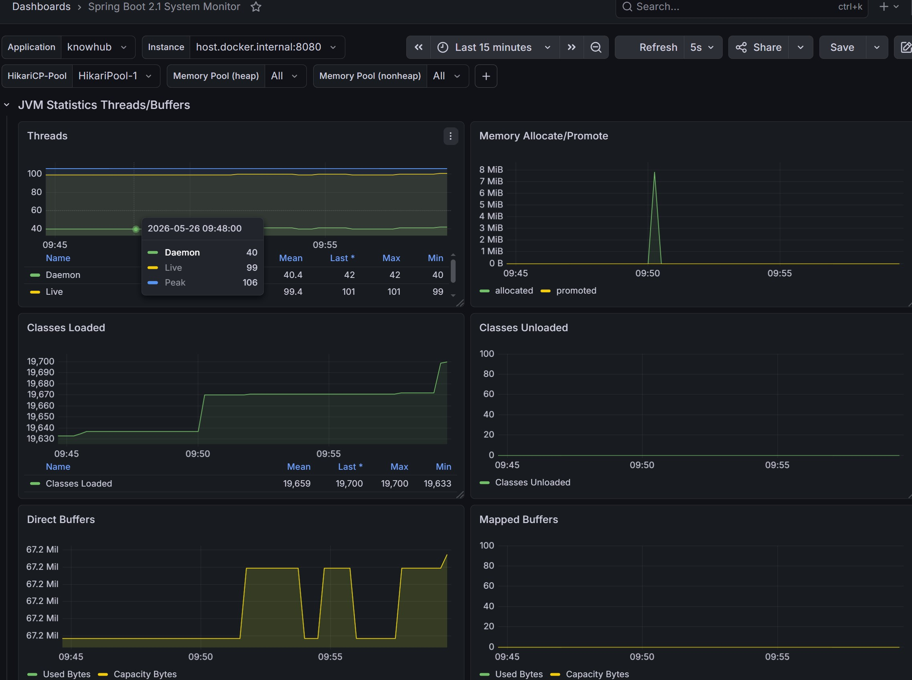
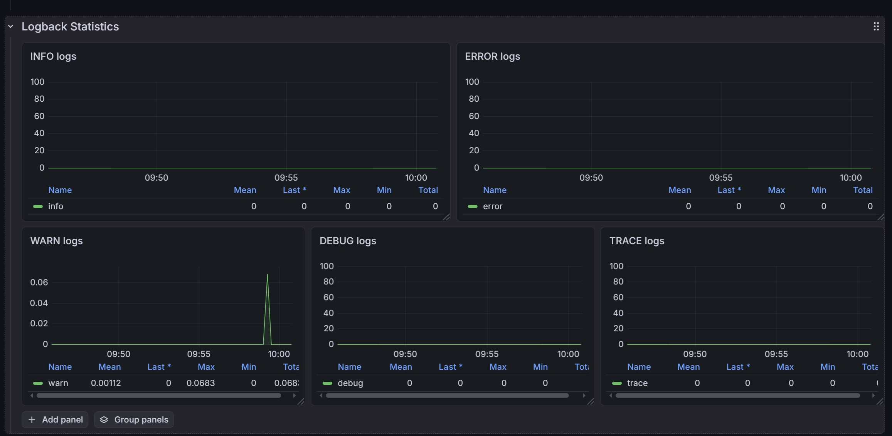
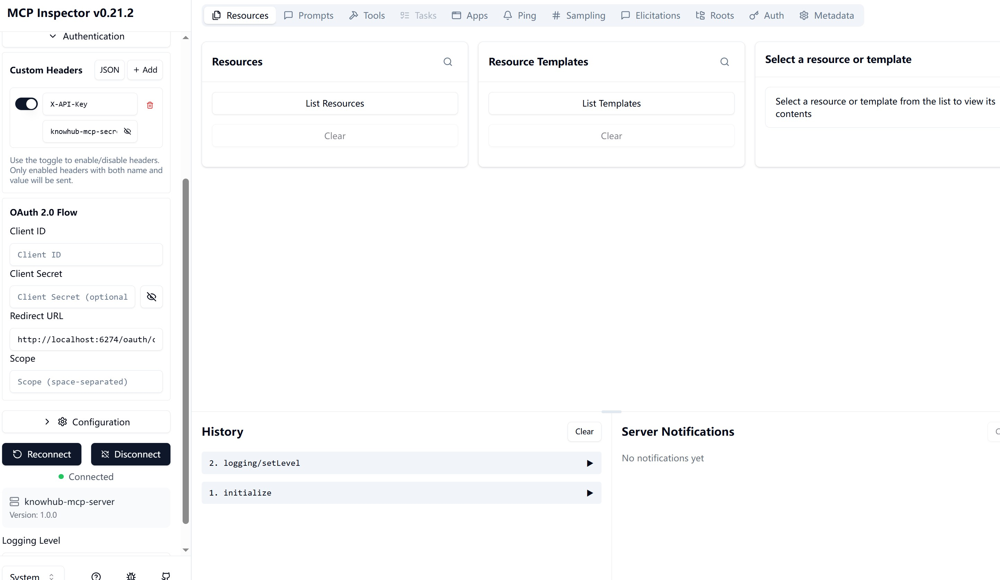

# KnowHub - 企业级多租户 AI 知识库平台

## 项目简介

KnowHub 是一个企业级多租户 AI 知识库平台，支持文档上传、智能向量化存储和 RAG 智能问答。
用户可上传 txt/pdf/md 文档，系统自动解析分块、生成 Embedding 存入向量数据库，生成 Embedding 存入向量数据库，通过混合检索（pgvector 向量检索 + ES 全文检索 BM25）经 RRF 融合和 Rerank 精排，获得基于文档内容的精确回答，支持 SSE 流式输出打字机效果。

## 技术栈

| 层次    | 技术选型                      | 选型理由                                   |
|-------|---------------------------|----------------------------------------|
| 框架    | Java 17 + Spring Boot 3.5 | LTS 版本，生态成熟                            |
| 业务数据库 | MySQL 8.0 + MyBatis-Plus  | 关系型数据，行级多租户隔离                          |
| 向量数据库 | PostgreSQL 16 + pgvector  | 不需要额外部署，余弦相似度检索                        |
| 搜索引擎 | Elasticsearch 8.13 | 全文检索，BM25 算法，替代 pgvector SQL |
| 数据同步 | Canal 1.1.7 | 监听 MySQL binlog，同步 document 元数据到 ES |
| 缓存    | Redis 7 + Redisson        | Cache Aside 缓存，分布式锁                    |
| 消息队列  | RabbitMQ 3.13             | 文档异步向量化，手动 ACK + 死信队列                  |
| AI    | Spring AI + 通义千问          | text-embedding-v3 生成向量，qwen-turbo 生成答案 |
| MCP Server | Spring AI MCP | 把 KnowHub 能力暴露给 AI 客户端，支持 Claude Desktop/Cursor 调用 |
| 认证    | JWT + Spring Security 6   | 无状态认证，前后端分离                            |
| 监控    | Prometheus + Grafana      | JVM 指标 + 业务指标可视化                       |
| 文档    | Swagger (springdoc 2.8)   | 接口文档，支持 JWT 认证测试                       |
| 基础设施  | Docker Compose            | 一键启动所有中间件                              |

## 核心功能

- **多租户隔离**：MyBatis-Plus TenantLineInnerInterceptor 自动加 user_id 过滤，防止跨租户数据泄露
- **文档异步向量化**：上传立即返回，RabbitMQ 后台异步处理，手动 ACK + 死信队列保证可靠性
- **RAG 智能问答**：文档分块 → Embedding → 混合检索（pgvector 相似检索 + ES BM25）→ RRF 融合 → Rerank 精排 → Prompt 构建 → LLM 流式生成
- **SSE 流式输出**：打字机效果，异步线程处理 LLM 调用，SecurityContext 跨线程传递
- **Redis 缓存**：Cache Aside 模式，数据变更主动删缓存，防缓存穿透
- **AOP 限流**：自定义 @RateLimit 注解，Redisson 令牌桶，问答接口 5次/秒
- **MCP Tool**：自定义 AI 可以调用的函数例：查知识库列表、文档列表、RAG 问答

## 架构图


## 快速启动

### 前置条件
- Java 17+
- Docker + Docker Compose
- 通义千问 API Key（https://bailian.console.aliyun.com）

### 启动步骤

```bash
# 1. 克隆项目
git clone https://github.com/你的用户名/knowhub.git
cd knowhub

# 2. 配置环境变量
cp .env.example .env
# 编辑 .env，填入 DASHSCOPE_API_KEY 和 JWT_SECRET 和 MCP_API_KEY

# 3. 启动中间件
docker compose up -d

# 4. 启动应用
# 在 IntelliJ 中设置环境变量后运行 KnowhubApplication
# 或：
export DASHSCOPE_API_KEY=your_key
export JWT_SECRET=your_secret
mvn spring-boot:run
```

### 访问地址
| 服务            | 地址 |
|---------------|------|
| API 接口        | http://localhost:8080 |
| Swagger 文档    | http://localhost:8080/swagger-ui/index.html |
| RabbitMQ 管理   | http://localhost:15672（admin/admin123）|
| Prometheus    | http://localhost:9090 |
| Grafana       | http://localhost:3000（admin/admin123）|
| MCP Inspector | nodejs 生成 npx @modelcontextprotocol/inspector |
| Elasticsearch | http://localhost:9200 |

## 压测数据

测试环境：100 并发线程，500 个请求，接口：GET /api/kb/{kbId}/documents

| 场景 | 平均响应时间 | 最大响应时间 | TPS | 错误率 |
|------|------------|------------|-----|--------|
| 无 Redis 缓存 | 41ms | 973ms | 50.2/s | 0% |
| 有 Redis 缓存 | 8ms | 45ms | 50.3/s | 0% |
| **提升幅度** | **5倍** | **22倍** | - | - |

## 监控截图





## MCP Server

KnowHub 实现了 MCP Server，把知识库能力暴露给任何支持 MCP 协议的 AI 客户端。

### 暴露的 Tool

| Tool | 描述 |
|------|------|
| listKnowledgeBases | 查询指定用户的知识库列表 |
| listDocuments | 查询指定知识库下的文档列表 |
| askQuestion | 在指定知识库中进行 RAG 智能问答 |

### 连接方式（MCP Inspector）

1. 运行 `npx @modelcontextprotocol/inspector`
2. Transport Type 选 SSE，URL 填 `http://localhost:8080/sse`
3. Authentication 展开，加 Header：
    - Name: `X-API-Key`
    - Value: `<你配置的 MCP_API_KEY 环境变量值>`
4. 点 Connect，在 Tools 里调用

### 认证

MCP 端点通过 API Key 认证，客户端需在请求头加：
`X-API-Key: <你配置的 MCP_API_KEY 环境变量值>`



## 关键设计决策

### 为什么选 pgvector 而不是 Milvus
pgvector 是 PostgreSQL 扩展，不需要额外部署和运维一套向量数据库。
对于中小规模 RAG 应用，pgvector 支持 ivfflat 索引和余弦相似度检索完全够用。
数据量到千万级以上再考虑迁移到专用向量数据库。

### 为什么用 SSE 而不是 WebSocket
问答场景是单向推送，服务器生成内容推给客户端，客户端不需要在推送过程中发消息。
SSE 比 WebSocket 更轻量，不需要握手协议，不需要维护双向连接。

### 为什么分 MySQL 和 PostgreSQL 两个数据库
MySQL 没有 VECTOR 数据类型，没有向量索引（ivfflat/hnsw），没有余弦相似度运算符。
PostgreSQL + pgvector 提供这三者，两个数据库职责不同，不能互相替代。

### 文档异步向量化
同步向量化需要等待 DashScope API 调用，可能耗时 10-30 秒，用户体验差。
改为 RabbitMQ 异步化后，上传立即返回 status=1，后台处理完更新 status=2。
手动 ACK 保证消息不丢失，死信队列处理反复失败的消息。

### 为什么引入 ES 替换 pgvector 全文检索
pgvector 的 to_tsvector 对中文支持很差，按字切分，搜索质量低。
ES 的 standard 分词器对英文效果好，后续可以加 IK 分词器支持中文。
BM25 算法比 pgvector 的 ts_rank 相关性评分更准确。
Canal 监听 MySQL binlog 实现 document 元数据实时同步到 ES，
是大厂常用的 MySQL → ES 数据同步方案。
